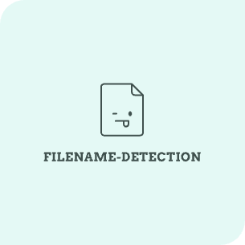

 <a href="./README.md">English</a> | 简体中文

检测新建文件或者文件重命名后可能存在的空格字符串，给出一个错误的弹窗，并且可以一键修复，新增了检测文件名拼写的英文单词是否正确，这个关键词会读取用户的user和workspace的settings认为合理的单词。

## 新特性 🚀

- 支持了中文命名，自动翻译提供最佳选择转换

## :coffee:

[请我喝一杯咖啡](https://github.com/Simon-He95/sponsor)

## License

[MIT](./LICENSE)

## Sponsors

  

